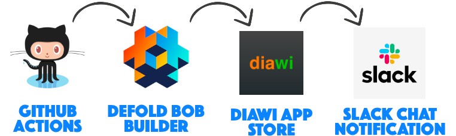
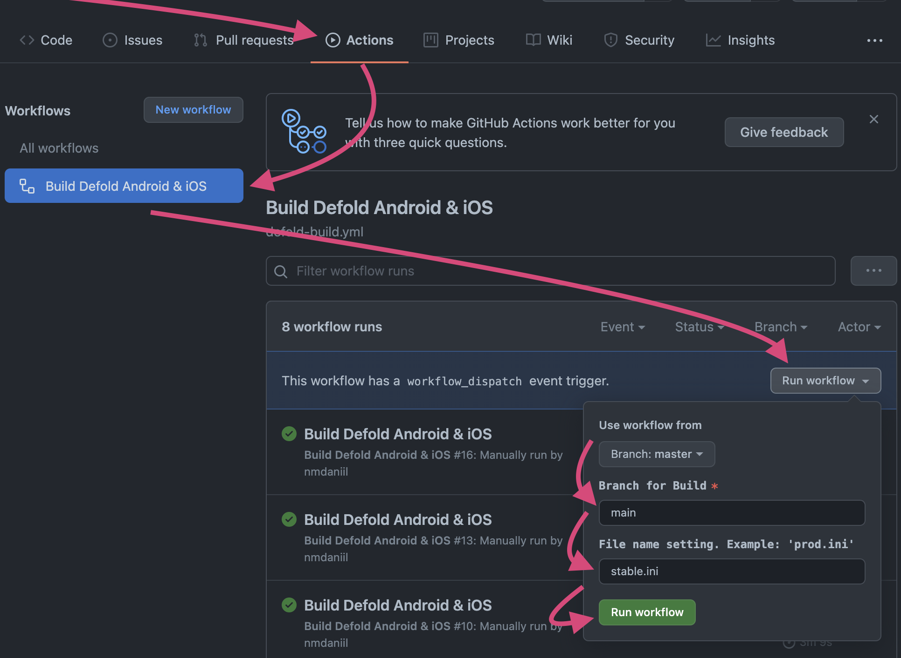
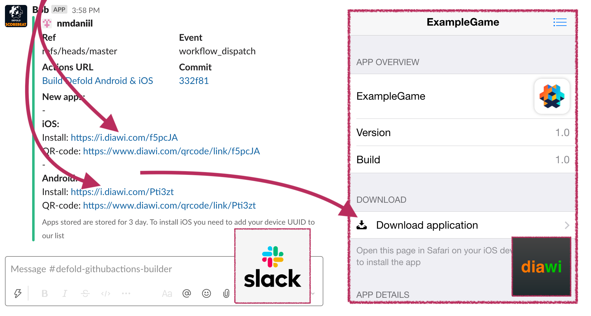
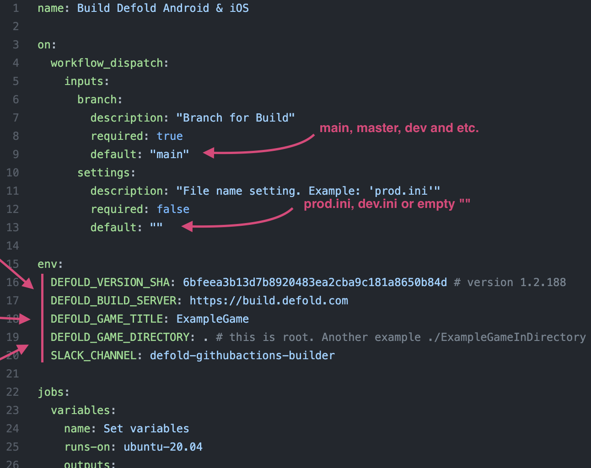

# Defold GitHub Actions Builder

Defold build workflow for Android & iOS.



Steps:

- Builds and signs apps (`.ipa`, `.apk`) using [Bob](https://defold.com/manuals/bob)
- Generate download links from a mobile device using [Diawi](https://www.diawi.com)
- Send generated links to [Slack](https://slack.com) channel

---

## Start build process

### Run workflow



### Get the links in Slack and install on your mobile device



---

## Setup workflow

### Copy
Copy the GitHub workflow file [.github/workflows/defold-build.yml](.github/workflows/defold-build.yml) into our project

### Change workflow file



### Set Secrets variables
Set the required secret variables for GitHub Actions.

(Section with secrets: GitHub Repository / Settings / Secrets)

| Secret      | Description |
| ----------- | ----------- |
| MACOS_BUILD_CERTIFICATE_BASE64 | Encrypted file content `.p12`, containing Apple Developer Certificate. And encoded in base64 for correct transmission to GitHub Secret.
|
| MACOS_P12_PASSWORD | Password to decrypted the file `.p12` |
|
| MACOS_BUILD_PROVISION_PROFILE_BASE64 | Apple profile file content `.mobileprovision` (in base64)
|
| DIAWI_TOKEN | API-token https://dashboard.diawi.com/profile/api, which generates links to pages for installing `.ipa` for iOS and `.apk` for Android
|
| SLACK_WEBHOOK | URL to webhook Slack https://slack.com/apps/A0F7XDUAZ-incoming-webhooks, which message is sent to the Slack with final apps.        |

Hint: command for base64 encoding and copy
```bash
$ base64 file.p12 | pbcopy
```
