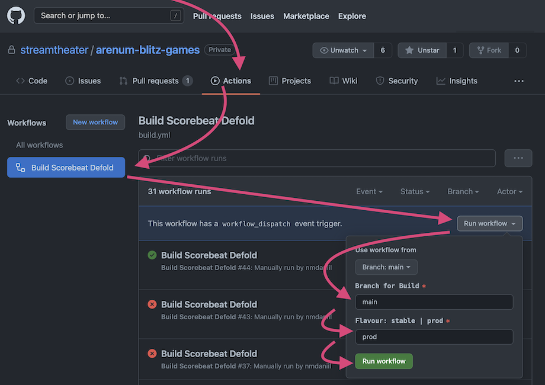
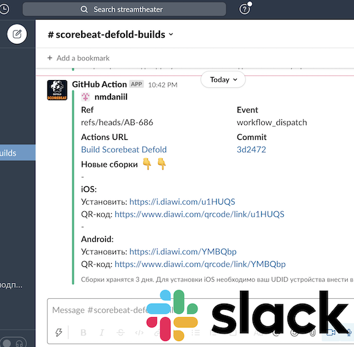

### Builds app for Android and iOS 



1. Go to **Actions**
2. Select workflow in the left column `Build Defold Android & iOS`
3. List of builds will be displayed. Above it, on the right, click on `Run workflow`
4. Enter the name of the branch and name flavor, then click in green button `Run workflow`
5. Refresh page and wait for the process to complete
6. After successful completion, links to apps sent to Slack channel



---

### GitHub Actions settings
#### GitHub Secrets (used for GitHub Actions)
- `MACOS_BUILD_CERTIFICATE_BASE64` - encrypted file content `.p12`, containing Apple Developer Certificate. 
And encoded in base64 for correct transmission to GitHub Secret. Hint: command for base64 encoding and copy 
```bash
$ base64 file.p12 | pbcopy
```
- `MACOS_P12_PASSWORD` - password to decrypted the file `.p12`
- `MACOS_BUILD_PROVISION_PROFILE_BASE64` - Apple profile file content `.mobileprovision` (in base64)
- `DIAWI_TOKEN` - API-token https://dashboard.diawi.com/profile/api, 
which generates links to pages for installing `.ipa` for iOS and `.apk` for Android
- `SLACK_WEBHOOK` - URL to webhook Slack https://slack.com/apps/A0F7XDUAZ-incoming-webhooks, 
which message is sent to the Slack with final apps.
